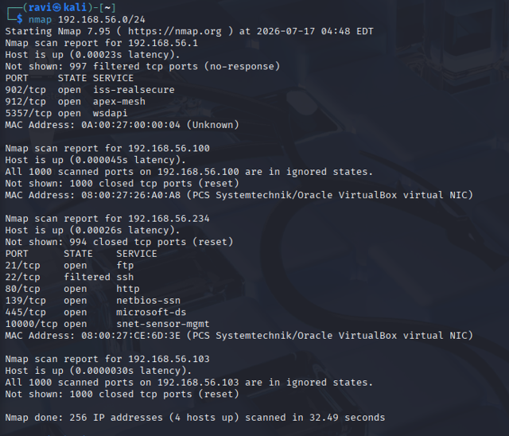
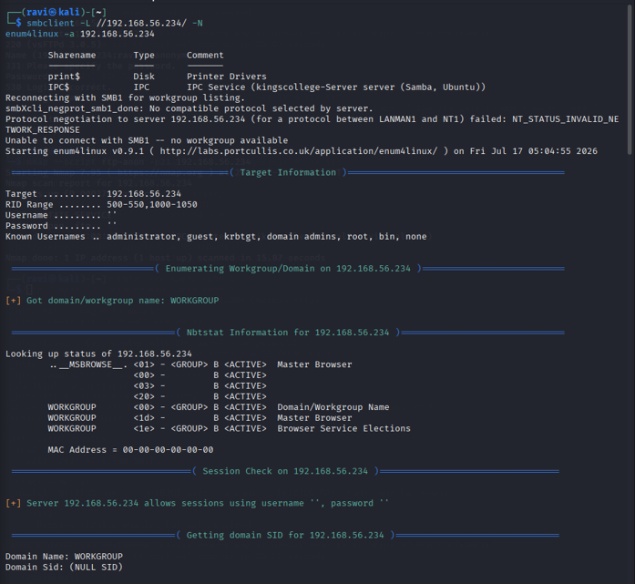
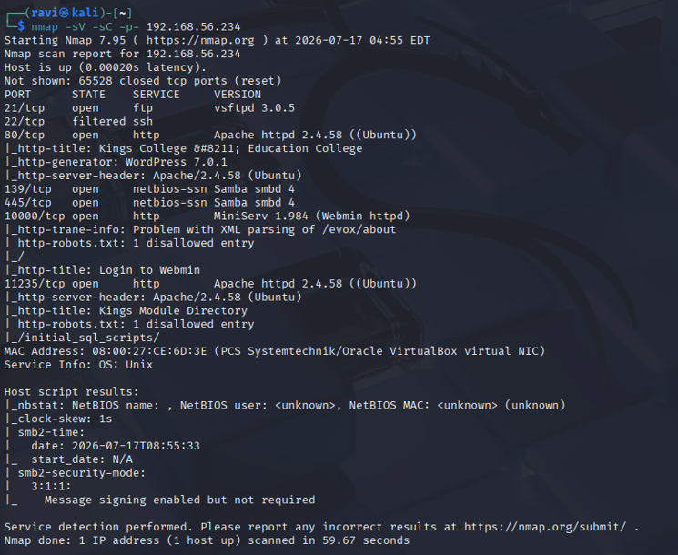
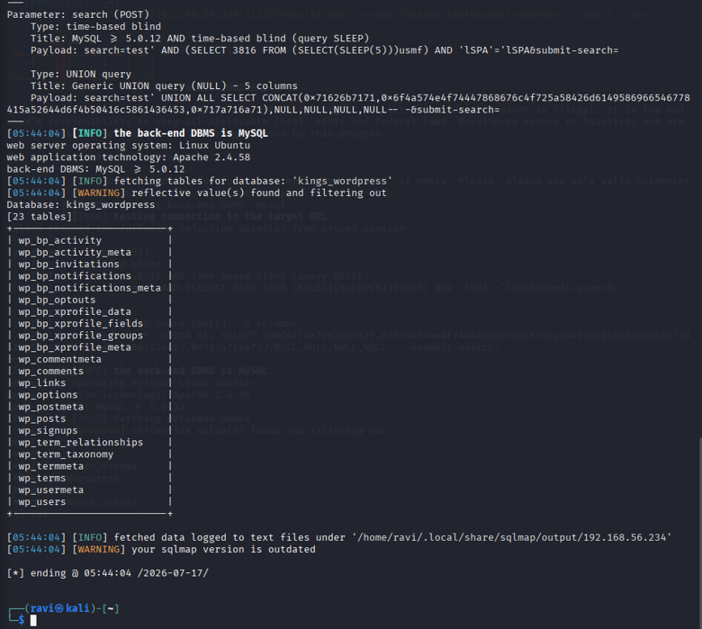
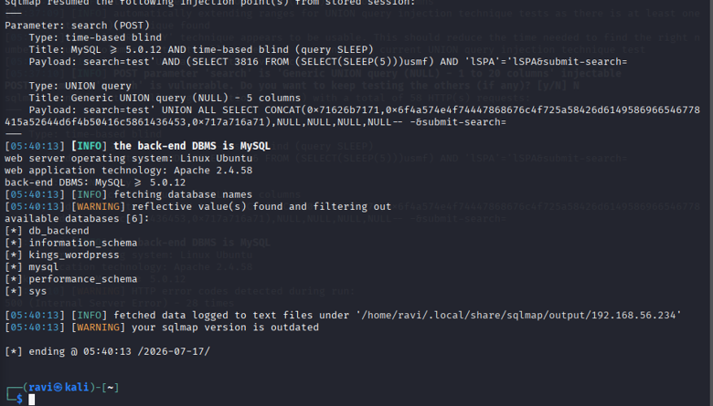
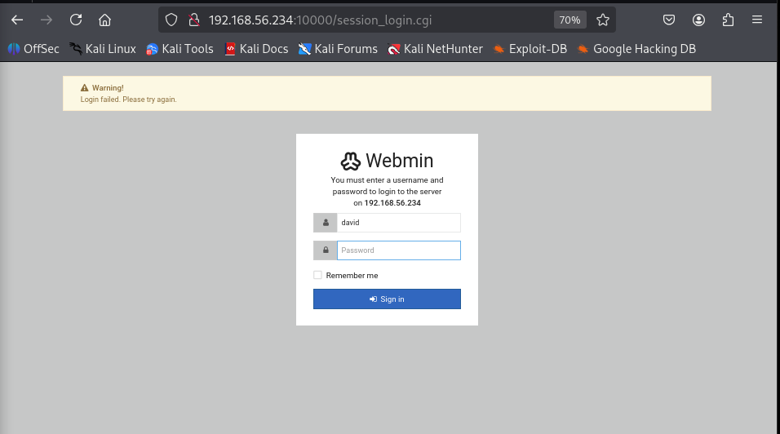
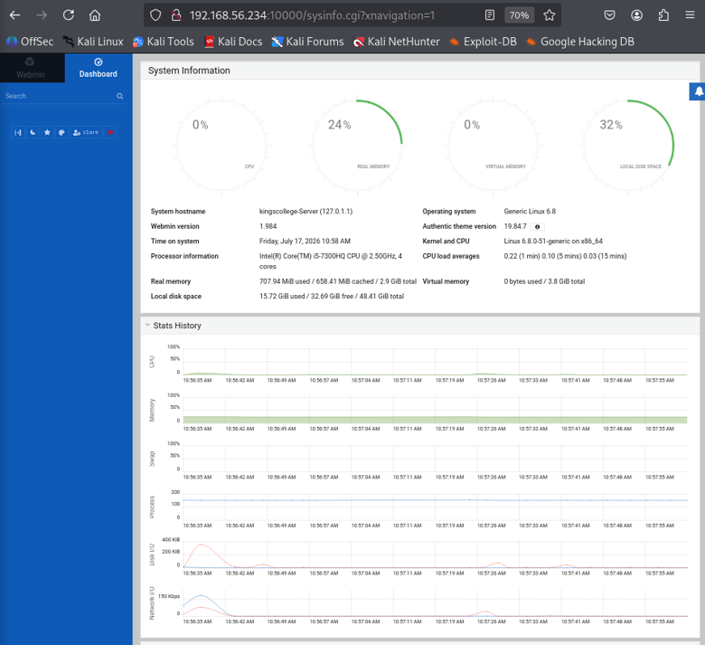
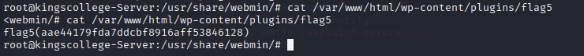
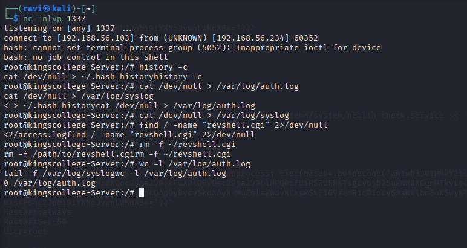

# Penetration Testing Evidence

## Overview

This directory contains selected evidence from an authorized penetration-testing assessment conducted against the **KingsCollege virtual machine**, an intentionally vulnerable academic laboratory target.

The evidence follows the assessment lifecycle from initial reconnaissance through exploitation and post-exploitation:

```text
Nmap Reconnaissance
        │
        ▼
SMB Enumeration
        │
        ▼
Web Application Discovery
        │
        ▼
SQL Injection
        │
        ▼
Database Compromise
        │
        ▼
Webmin Assessment
        │
        ▼
Remote Code Execution
        │
        ▼
Root Access
        │
        ▼
Post-Exploitation
```

> All evidence originates from a controlled and authorized academic security assessment. Sensitive values such as passwords, assessment flags, hashes, personal records, and reusable credentials are intentionally excluded or redacted where appropriate.

---

# Evidence Map

| # | Evidence | Assessment Stage | Demonstrates |
| ---: | --- | --- | --- |
| 01 | Nmap Service Discovery | Reconnaissance | Exposed ports, services and attack surface |
| 02 | SMB Enumeration | Enumeration | SMB/account and authentication-policy exposure |
| 03 | Kings Module Directory | Application Discovery | Identification of the vulnerable web application |
| 04 | SQL Injection Validation | Vulnerability Assessment | Confirmation of SQL injection |
| 05 | Database Enumeration | Exploitation | Unauthorized database enumeration/access |
| 06 | Webmin Version & Login | Enumeration / Initial Access | Vulnerable administrative service and authentication path |
| 07 | Webmin RCE / Root Shell | Exploitation | Remote command execution and privileged shell |
| 08 | Root Access Validation | Impact Validation | Root-level operating-system access |
| 09 | Post-Exploitation Persistence | Post-Exploitation | Persistence-risk demonstration |

---

# 01 — Network Service Discovery



## Purpose

The assessment began with active network reconnaissance using **Nmap**.

The objective was to identify:

- Reachable services
- Open ports
- Service types
- Service versions
- Potential attack surfaces

The original assessment identified services including:

```text
21      FTP
22      SSH
80      HTTP
139/445 SMB
10000   Webmin
11235   HTTP
```

Not every exposed service was exploitable.

For example:

- FTP had anonymous authentication disabled.
- SSH appeared filtered.
- SMB exposed useful enumeration information.
- Webmin exposed an administrative interface.
- Port 11235 hosted the Kings Module Directory.

This illustrates an important penetration-testing distinction:

```text
Open Port
   ≠
Vulnerability
```

Service discovery provides the information required to determine where deeper investigation should occur.

---

# 02 — SMB Enumeration



## Purpose

Following service discovery, SMB was enumerated using:

```text
enum4linux
```

The objective was to determine whether the service disclosed useful information about:

- Local users
- Authentication policy
- Network resources
- Account configuration

The original assessment successfully enumerated multiple local accounts.

For portfolio purposes, the account identities themselves are not important; the significant finding is that valid usernames could be obtained through SMB enumeration.

---

## Password Policy Findings

The assessment also identified weak password controls.

Observed weaknesses included:

```text
Password complexity: Disabled
Minimum password length: 5 characters
Account lockout: Not configured
```

This substantially increased the authentication attack surface.

Conceptually:

```text
SMB Enumeration
      │
      ▼
Valid Usernames
      │
      +
Weak Password Policy
      │
      ▼
Increased Credential Attack Risk
```

The weak authentication controls later contributed to successful authentication against the Webmin administrative interface.

---

# 03 — Kings Module Directory



## Application Discovery

Reconnaissance identified a second HTTP service on:

```text
TCP/11235
```

hosting the **Kings Module Directory** application.

The application became one of the primary attack surfaces during the assessment.

Directory and application enumeration identified resources including:

```text
/results.php
/index.php
/phpmyadmin/
/initial_sql_scripts/
```

The exposed SQL-script resources provided information about the application's backend database structure.

---

## Security Significance

Information disclosure does not always directly compromise a system.

However, information exposure can make another vulnerability easier to exploit.

In this case:

```text
Application Enumeration
        │
        ▼
Database Structure Information
        │
        ▼
Improved Understanding
        │
        ▼
SQL Injection Investigation
```

This demonstrates how apparently separate findings can contribute to a larger attack chain.

---

# 04 — SQL Injection Validation



## Vulnerability

The `/results.php` search functionality accepted user-controlled input without adequate validation or parameterized database queries.

Initial manual testing produced database behavior indicating unsafe input handling.

HTTP requests were then inspected using:

```text
Burp Suite
```

and the suspected injection condition was validated using:

```text
sqlmap
```

---

## Confirmed Injection Techniques

The original assessment confirmed:

```text
Time-based blind SQL injection
UNION-based SQL injection
```

The vulnerability allowed backend database enumeration without normal application authorization.

---

## Attack Path

```text
User-Controlled Search Input
          │
          ▼
      /results.php
          │
          ▼
Unsafe SQL Construction
          │
          ▼
      SQL Injection
          │
          ▼
   Backend Database
```

---

## Security Impact

Successful SQL injection can affect:

- Confidentiality
- Integrity
- Authentication
- Application trust boundaries

The actual impact depends on the permissions assigned to the application's database account.

In this assessment, the vulnerability allowed unauthorized access to multiple databases.

---

# 05 — Database Enumeration



## Exploitation Evidence

Following SQL injection validation, database enumeration identified:

```text
db_backend
kings_wordpress
```

The first contained application/student-related data, while the second supported the WordPress installation discovered during reconnaissance.

The important portfolio evidence is the ability to enumerate otherwise unauthorized database resources—not the sensitive records themselves.

---

## Cross-Application Impact

The assessment demonstrated that one vulnerable application could expose information belonging to multiple databases hosted within the same environment.

Conceptually:

```text
Kings Module Directory
        │
        ▼
SQL Injection
        │
        ▼
Database Server
      /     \
     /       \
db_backend  kings_wordpress
```

This demonstrates why database-account permissions and application isolation are important defensive controls.

---

## Remediation

Primary remediation includes:

- Parameterized queries
- Prepared statements
- Input validation
- Least-privileged database accounts
- Removal of unnecessary exposed SQL resources
- Secure error handling
- Application security testing
- Web application monitoring

---

# 06 — Webmin Version & Authentication



## Service Discovery

Nmap identified an administrative Webmin interface on:

```text
TCP/10000
```

The installed version was:

```text
Webmin 1.984
```

Version analysis identified this release as affected by:

```text
CVE-2022-0824
```

---

## Vulnerability Context

CVE-2022-0824 affects vulnerable Webmin functionality and permits authenticated remote code execution.

Authentication was therefore an important prerequisite.

The weak password controls discovered during SMB enumeration reduced the security of this boundary.

This produced a chained attack path:

```text
SMB Enumeration
       │
       ▼
Known User Accounts
       │
       +
Weak Password Policy
       │
       ▼
Webmin Authentication
       │
       ▼
Vulnerable Webmin 1.984
```

---

# 07 — Webmin Remote Code Execution



## Exploitation

After obtaining authorized lab access to the Webmin interface, the assessment validated:

```text
CVE-2022-0824
```

using a public proof-of-concept associated with:

```text
Exploit-DB 50809
```

The vulnerability was used to execute a controlled payload and establish a reverse-shell connection from the laboratory target.

---

## Security Impact

The resulting shell executed with elevated privileges.

This changed the assessment from:

```text
Vulnerable Service Identified
```

to:

```text
Vulnerability Exploited
        │
        ▼
Remote Code Execution
        │
        ▼
Operating-System Access
```

That distinction is important because successful exploitation demonstrates actual impact rather than theoretical exposure.

---

# 08 — Root Access Validation



## Privilege Validation

Following successful exploitation, privilege verification confirmed **root-level access** to the laboratory system.

Root privileges represent the highest administrative level on the target Linux environment.

This provides extensive control over:

- Files
- Services
- Accounts
- Configuration
- Applications
- Logs
- Security controls

---

## Impact

The original assessment demonstrated that root compromise enabled unrestricted filesystem exploration and access to protected application/system resources.

Conceptually:

```text
Remote Code Execution
        │
        ▼
Privileged Shell
        │
        ▼
Root Access
        │
        ├── System Files
        ├── Application Data
        ├── User Resources
        ├── Service Configuration
        └── Persistence Capability
```

---

## Defensive Lesson

Administrative interfaces must receive substantially stronger protection than ordinary application services.

Controls should include:

- Prompt patching
- MFA
- Strong authentication
- Network-based access restrictions
- Least privilege
- Centralized logging
- Administrative activity monitoring

---

# 09 — Post-Exploitation Persistence



## Purpose

After root compromise, limited post-exploitation activity was performed to demonstrate the potential consequences of full administrative access.

A persistence mechanism was created using a:

```text
systemd service
```

within the authorized lab.

The service demonstrated how an attacker with root access could establish execution that survives service/system restart.

---

## Persistence Model

```text
Root Access
    │
    ▼
Privileged Configuration Change
    │
    ▼
systemd Service
    │
    ▼
Automatic Execution
    │
    ▼
Persistent Access
```

The persistence mechanism was tested to verify that access could be restored without repeating the original exploitation path.

---

# Post-Exploitation & Anti-Forensic Risk

The original assessment also demonstrated basic anti-forensic concepts after compromise.

The purpose was to illustrate that a privileged attacker may attempt to interfere with local evidence sources such as:

- Authentication logs
- System logs
- Command history
- Temporary exploitation artifacts

This leads to an important defensive principle:

> Security telemetry should not exist only on the system being monitored.

If the host itself is fully compromised, locally stored evidence may no longer be trustworthy.

---

## Defensive Controls

Relevant controls include:

```text
Centralized Logging
        +
SIEM
        +
EDR
        +
Network Telemetry
        +
File Integrity Monitoring
```

These controls provide evidence outside the compromised host and improve incident-response visibility.

---

# Complete Assessment Chain

The evidence collectively demonstrates the following progression:

```text
                    Nmap
                      │
                      ▼
              Service Discovery
                      │
             ┌────────┴────────┐
             │                 │
             ▼                 ▼
            SMB          Web Applications
             │                 │
             ▼                 ▼
     User Enumeration   Directory Discovery
             │                 │
             ▼                 ▼
    Weak Passwords       SQL Injection
             │                 │
             │                 ▼
             │          Database Access
             │
             ▼
      Webmin Authentication
             │
             ▼
        Webmin 1.984
             │
             ▼
       CVE-2022-0824
             │
             ▼
    Remote Code Execution
             │
             ▼
         Root Access
             │
             ▼
      Post-Exploitation
             │
       ┌─────┴─────┐
       ▼           ▼
 Persistence    Impact Analysis
```

The key security lesson is that compromise resulted from a **chain of weaknesses** rather than one isolated issue.

---

# Evidence Classification

The repository distinguishes between three evidence levels.

## Observed

Directly identified during reconnaissance or enumeration.

Examples:

- Open ports
- Service versions
- Web applications
- SMB exposure
- User information

## Validated

Confirmed through additional testing.

Examples:

- Weak password policy
- SQL injection
- Vulnerable Webmin version

## Exploited

Successfully used in the authorized laboratory to demonstrate impact.

Examples:

- Database access
- Remote code execution
- Root shell
- Persistence demonstration

---

# Evidence Handling

Some information from the original assessment is intentionally not reproduced in this public repository.

Examples include:

- Assessment flags
- Passwords
- Password hashes
- Personal/student records
- Authentication tokens
- Unnecessary account details

The objective is to demonstrate the technical assessment process without unnecessarily publishing sensitive values.

---

# Active Directory Scope

Despite the repository name, this evidence does **not** establish a complete Active Directory penetration test.

The preserved assessment demonstrates:

- Internal network reconnaissance
- SMB enumeration
- User enumeration
- Password-policy analysis
- Web application testing
- SQL injection
- Administrative-service exploitation
- Remote code execution
- Root compromise
- Post-exploitation

The evidence does not establish completion of techniques such as:

```text
BloodHound / SharpHound
Kerberoasting
AS-REP Roasting
LDAP domain enumeration
Pass-the-Hash
Pass-the-Ticket
DCSync
Golden Ticket
NTDS.dit extraction
Domain Admin compromise
Domain Controller compromise
```

Those techniques should only be claimed when separately performed and evidenced in an authorized Active Directory environment.

---

# Ethical & Authorization Statement

All testing represented in this evidence set was performed against an intentionally vulnerable virtual machine as part of an authorized academic cybersecurity assessment.

The evidence is retained for:

- Defensive security education
- Technical portfolio demonstration
- Vulnerability-management learning
- Penetration-testing methodology analysis

It does not provide authorization to test third-party systems.

---

## Related Documentation

- [Assessment Methodology](../docs/assessment-methodology.md)
- [Technical Findings & Remediation](../docs/findings.md)
